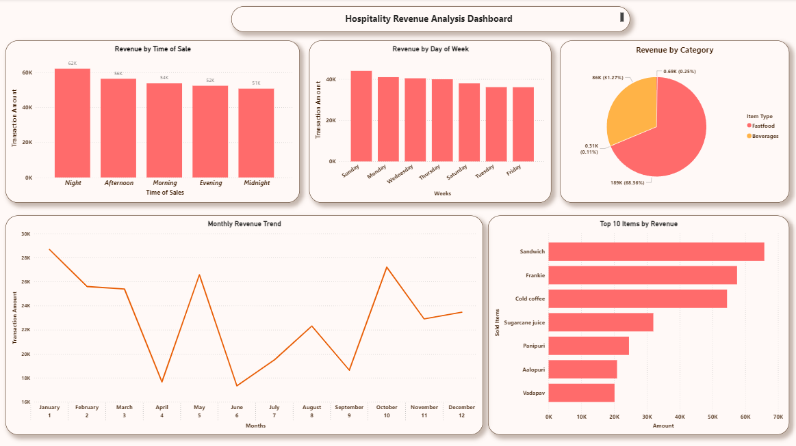

# Hospitality Revenue Analysis Dashboard

## Project Overview
An end-to-end business analytics project analysing 1,000 fast food 
sales transactions across a 12 month period (April 2022 - March 2023). 
Built to demonstrate data-driven decision making for operational efficiency.

## Business Problem
How can a hospitality business maximise revenue, reduce waste, and 
optimise staffing by understanding when, why, and how customers spend?

## Tools Used
- Python (pandas, matplotlib) — Data cleaning and analysis
- Power BI — Interactive dashboard and visualisation
- Jupyter Notebook — Development environment
- GitHub — Version control and portfolio publishing

## Key Findings
- Night trading generates the highest revenue at 62K
- January is the strongest month accounting for 10.4% of annual revenue
- April and June are the weakest months — nearly 40% below peak
- Sandwich, Frankie and Cold Coffee are the top 3 revenue drivers
- Fastfood drives 68% of revenue vs 32% for Beverages

## Dashboard Preview


## Business Recommendations
See full recommendations in the insights folder

## Project Structure
```
hospitality-revenue-dashboard/
├── hospitality_revenue_analysis.ipynb
├── clean_sales_data.csv
├── business_recommendations.md
├── dashboard_screenshot.png
└── hospitality_revenue_dashboard.pdf
```
## About
Built by Vishnu Karthikeyan | MSc Business Analytics | 
Passionate about turning data into business decisions
